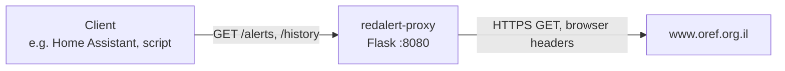

# Red Alert Proxy

A small Python/Flask service, packaged as a Docker image, that proxies the Israeli
Home Front Command (Pikud HaOref) red alert feed. It exposes two plain HTTP endpoints: the
current alert and the alert history. Home automation tools and dashboards can poll it instead
of calling the Oref website directly.

> [!WARNING]
> **Unofficial. Not for life safety.**
> This project is not affiliated with, endorsed by, or connected to Pikud HaOref (the Home
> Front Command) or the Israel Defense Forces. It relays data from a public website that can
> change, go down, or block requests at any time, and it adds its own delay and failure points.
> **Never rely on it to protect people.** Use the official Home Front Command app, the official
> website, and the outdoor sirens, and follow the Home Front Command's instructions.

## Table of Contents

- [Features](#features)
- [How it works](#how-it-works)
- [Requirements](#requirements)
- [Installation](#installation)
- [Configuration](#configuration)
- [API](#api)
- [Troubleshooting](#troubleshooting)
- [Security notes](#security-notes)
- [Development](#development)
- [Contributing](#contributing)
- [License](#license)

## Features

- `GET /alerts`: returns the current alert JSON from Oref, passed through unchanged.
- Optional region filter: `/alerts` returns the alert only when the raw alert data contains
  the configured `REGION` text, or always when `REGION` is `*`.
- `GET /history`: returns the Oref alert history, wrapped in a `{"history": ...}` JSON object.
- History language selectable with `LANGUAGE` (`he`, `en`, `ru`, `ar`).
- Sends the browser-style headers (`Referer`, `User-Agent`, `X-Requested-With`) that the Oref
  site expects.
- Single file (`proxy.py`), shipped as a Docker image.

## How it works



Every request to the proxy triggers one request to Oref. There is **no caching and no
background polling**: how often Oref is called depends only on how often clients call the
proxy.

| Proxy endpoint | Upstream URL |
|---|---|
| `/alerts` | `https://www.oref.org.il/WarningMessages/alert/alerts.json` |
| `/history` | `https://www.oref.org.il/Shared/Ajax/GetAlarmsHistory.aspx?lang=<LANGUAGE>&mode=1` |

<!-- TODO: verify that the GetAlarmsHistory.aspx history endpoint still exists on the Oref site -->

Headers sent upstream:

| Header | Value |
|---|---|
| `Referer` | `https://www.oref.org.il/` |
| `User-Agent` | `Mozilla/5.0 (Windows NT 10.0; Win64; x64) AppleWebKit/537.36 (KHTML, like Gecko) Chrome/78.0.3904.97 Safari/537.36` |
| `X-Requested-With` | `XMLHttpRequest` |

The proxy does nothing else to reach Oref. It must run on a host that Oref accepts requests
from (the Oref site is known to restrict access from some locations).
Run it responsibly: poll at a sensible rate and don't turn it into a public relay.

## Requirements

- Docker (and optionally Docker Compose), **or** Python 3 with `flask`, `loguru` and `urllib3`.
- Outbound HTTPS access to `www.oref.org.il` from the host running the proxy.

## Installation

The image is based on `ubuntu:18.04` ([Docker Hub](https://hub.docker.com/_/ubuntu)) and runs
`python3 /opt/redalert/proxy.py`, listening on port `8080`.

The published image `techblog/redalert-proxy:latest` is `linux/amd64` only. On ARM hosts
(for example a Raspberry Pi), [build the image yourself](#build-the-image-yourself).

### Docker Compose (image from Docker Hub)

A sample file is included as [`docker-copmose.yaml`](docker-copmose.yaml) (note the file name
spelling). Replace the placeholder values before use:

```yaml
version: "3.6"
services:
  redalert-proxy:
    image: techblog/redalert-proxy
    container_name: redalert_proxy
    restart: always
    environment:
      - LANGUAGE=he   # history language: he, en, ru or ar
      - REGION=*      # * for any region, or a region name as it appears in the alert data
    ports:
      - "8080:8080"
```

```bash
docker compose -f docker-copmose.yaml up -d
```

### Docker

```bash
docker run -d --name redalert_proxy --restart always \
  -e LANGUAGE=he -e REGION='*' \
  -p 8080:8080 techblog/redalert-proxy
```

### Build the image yourself

```bash
docker build -t redalert-proxy .
docker run -d -e LANGUAGE=he -e REGION='*' -p 8080:8080 redalert-proxy
```

### Run without Docker

```bash
pip3 install flask loguru urllib3
REGION='*' LANGUAGE=he python3 proxy.py
```

## Configuration

Configuration is by environment variable only. There are no command-line flags or config files.

| Variable | Default | Description |
|---|---|---|
| `REGION` | none in `proxy.py`; see note | Filter for `/alerts`. `*` returns every alert. Any other value is matched as plain text against the raw alert data, and the alert is returned only if that text appears in it. Does not affect `/history`. |
| `LANGUAGE` | none in `proxy.py`; see note | Language of `/history`: `he` (Hebrew), `en`, `ru` or `ar`. Does not affect `/alerts`. |

> [!IMPORTANT]
> **Always set both `REGION` and `LANGUAGE` explicitly.**
> - `proxy.py` has no defaults. If `REGION` is not set when you run `proxy.py` directly, it
>   fails at startup.
> - The `Dockerfile` intends to set `REGION="*"` and `LANGUAGE="he"`, but it writes them as
>   `ENV REGION = "*"` and `ENV LANGUAGE = "he"` (with spaces around `=`). Docker reads that as
>   the value `= *` and `= he`, not `*` and `he`. With those values `/alerts` returns an empty
>   body even during an alert, and the history URL gets an invalid `lang` value.
>   `Dockerfile` and `proxy.py` are unchanged since the published image was built on 2021-05-17,
>   so the image on Docker Hub has `REGION` set to `= *` and `LANGUAGE` set to `= he`.

The listen address (`0.0.0.0`) and port (`8080`) are fixed in `proxy.py`. To use another host
port, change the port mapping (for example `-p 9000:8080`).

## API

The proxy has two endpoints. It sets no CORS headers, so a browser page on another origin can't
read the responses directly.

Content types and status codes:

- Successful responses are served with Flask's default `text/html` content type, even though the
  body is JSON.
- The error paths return `jsonify(...)`: HTTP 200, `application/json`, and a body that is just a
  JSON string (the error message, or for `/history` the fallback `{"history": ""}` as a string).
  Clients that only check for HTTP 200 could mistake an error string for alert data, so check
  the body before acting on it.
- The proxy never checks the upstream HTTP status. If Oref answers with an error or a block page,
  that body is passed through with HTTP 200 (see [Troubleshooting](#troubleshooting)).

### `GET /alerts`

Returns the Oref current-alert JSON unchanged when there is an active alert that matches
`REGION`. Returns an empty body (HTTP 200) when there is no alert, or when the alert doesn't
match `REGION`.

```bash
curl -s http://localhost:8080/alerts
```

The body is whatever Oref returns. The format is set by Oref, not by this project, and may change.
<!-- TODO: verify and add a sample alerts.json payload -->

### `GET /history`

Returns the Oref alert history in the language set by `LANGUAGE`, wrapped in a JSON object.
The history is stored as a **string** under `history`, so clients must parse it a second time.

```bash
curl -s http://localhost:8080/history
```

```json
{"history": "<raw response from Oref, as a string>"}
```

If Oref returns JSON, you can decode the inner history with `jq`:

```bash
curl -s http://localhost:8080/history | jq '.history | fromjson'
```

## Troubleshooting

- **`proxy.py` exits at startup with a `TypeError` (running without Docker).** `REGION` isn't
  set. Set it (for example `REGION=*`). The Docker image always sets `REGION`, although to the
  broken value `= *` (see below).
- **`/alerts` is always empty.**
  - There may simply be no active alert.
  - `REGION` must be `*` or text that appears exactly in the alert data (for example the Hebrew
    area name as Oref writes it).
  - If you rely on the image defaults, `REGION` is `= *` (see [Configuration](#configuration)).
    Set it explicitly.
- **`/history` returns an error or odd data.** Check that `LANGUAGE` is exactly `he`, `en`, `ru`
  or `ar`, and that the upstream history URL still works.
- **HTTP 500 errors.** The proxy couldn't connect to Oref at all (a network or TLS failure).
  The error is raised after urllib3's default of 3 retries. The upstream call has no timeout.
  Check the container logs (`docker logs redalert_proxy`); the upstream URLs are logged at startup.
- **Unexpected content with HTTP 200.** The proxy never checks the upstream HTTP status, so an
  upstream error or block page is not a 500. It is returned with HTTP 200: as-is from `/alerts`
  when `REGION` is `*`, and wrapped in `{"history": ...}` by `/history`. Check the response body
  to see what Oref actually sent.
- **Browser requests fail with a CORS error.** The proxy sends no CORS headers. Call it from a
  server-side client, or put it behind a reverse proxy that adds them.

## Security notes

- **Don't expose it to the internet.** There is no authentication and no rate limiting. Anyone
  who can reach port `8080` can make your server call Oref as often as they like. Keep it on a
  trusted LAN, or behind a reverse proxy with access control and rate limiting.
- The app runs Flask's built-in development server with `debug=True`. This turns on the Werkzeug
  interactive debugger, which lets anyone who can reach the port run arbitrary code on the
  host. This is another reason to never expose the port to untrusted networks.
- The base image is `ubuntu:18.04`, which no longer gets standard security updates.
- The proxy stores no credentials or data. It only relays public alert information.

## Development

Project layout:

| File | Purpose |
|---|---|
| `proxy.py` | The Flask application (both endpoints). |
| `Dockerfile` | Builds the `ubuntu:18.04`-based image. |
| `docker-copmose.yaml` | Sample Docker Compose file. |
| `License` | Apache License 2.0. |

There are no tests, CI workflows, or GitHub releases in this repository.

The Docker Hub image `techblog/redalert-proxy` has a single tag, `latest`, pushed on 2021-05-17,
and is built for `linux/amd64` only. No arm64 or armv7 image exists, so on ARM hosts (for example
a Raspberry Pi) [build the image yourself](#build-the-image-yourself).

## Contributing

Issues and pull requests are welcome. Keep changes small, and describe how you tested them
against the live feed.

## License

Licensed under the [Apache License 2.0](License).
